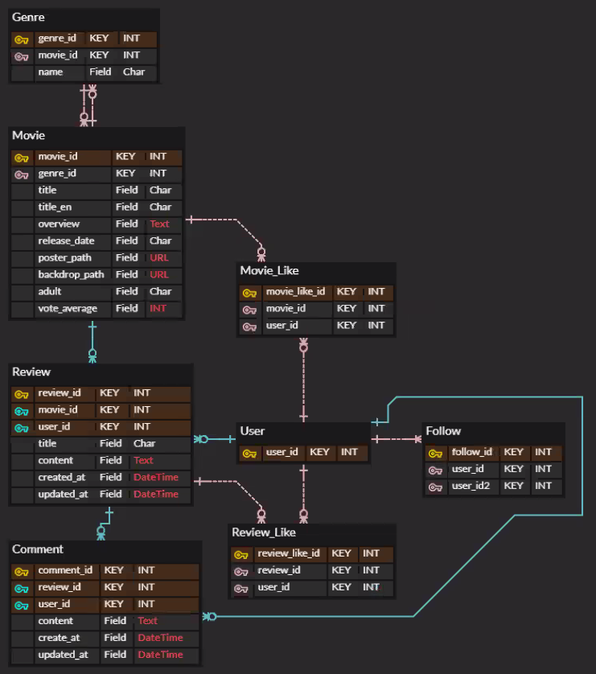
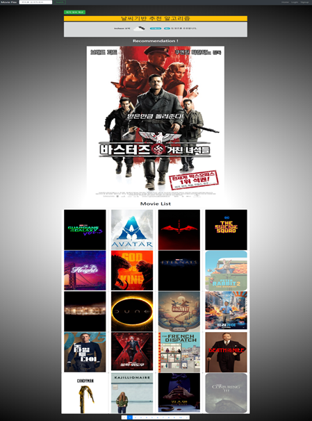

# Welcome to Movie Flex 👋

> 영화 정보 기반 추천 서비스 구성
>
> 커뮤니티 서비스 구성
>
> HTML, CSS, JavaScript, Vue.js, Django, REST API, DataBase 등

## :one: 팀원 정보 및 업무 분담 내역

👤 **강재구**

* Website: 94incheon.github.io
* Github: [@kjaegu9771](https://github.com/kjaegu9771)
* **업무 분담**
  * Frontend
  * Bootstrap4
  * DB
  * Movies 앱의 MTV 패턴구현
  * 날씨기반 영화추천 알고리즘
  * 페이징

👤 **장현준**

- Github: [@jhj9109](https://github.com/jhj9109)

- **업무 분담**
  - Django REST API
  - 비동기 요청
  - ORM 조작
  - Accounts 앱의 MTV 패턴구현
  - 접속지역 날씨기반 영화추천 알고리즘
  - 소셜로그인

## :two: 목표 서비스 구현 및 실제 구현 정도

- TMDb 에서 제공하는 Movie API 를 통한 영화정보 제공
- 유저들간 커뮤니티를 위한 리뷰게시판 구현
- 리뷰간 Comment 를 작성할 수 있다.
- 영화&리뷰 좋아요 - 비동기요청 처리가능
- 유저간 팔로우&팔로워 - 비동기 요청 처리가능
- 회원가입없이 Google 아이디를 통한 로그인가능
- 영화 제목 (한글, 영문) 을 통한 검색기능
- 본인이 좋아요한 영화들 마이페이지 내에서 확인가능

## :three: 사용 기술 및 개발 계획

- **사용기술**
  - Django 템플릿에서 Vue CDN을 이용해 개발

- Frontend
  - Vue
  - Axios
  - Font Awesome
  - Bootstrap4

- Backend
  - Python
  - Django==2.1.15
  - Django REST Framework

- **개발 계획**
  - 진행 기간 : 2020.06.11 ~ 2020.06.17
  - 목표 : 영화 포털 사이트의 기본 기능을 빠르게 구현하기

## :four: 데이터베이스 모델링(ERD)

## :four: 핵심 기능

- **영화 추천**

  - 날씨 API 와 지리를 이용한 접속위치 날씨의 따른 영화추천

  

- **리뷰 커뮤니티 게시판**

  - 로그인한 유저는 게시판의 CRUD 기능 사용가능
  - 댓글을 작성할 수 있음
  - 좋아요 구현

- **유저 프로필**
  - 팔로우 & 팔로워 비동기 요청
  - 내가 현재 팔로우하고 있는사람 목록 확인
  - 나를 현재 팔로워하고 있는사람 목록 확인
  - 내가 작성한 댓글 개수 표시기능
  - 내가 좋아요한 영화 목록 표시
  - 비동기 요청처리로 구현

- **영화 검색**
  - 상단 NavBar 에 있는 Search bar에서 영화명(한글, 영문)으로 영화 검색가능

- **UI/UX**
  - Bootstrap4 를 활용한 웹 반응형 홈페이지 구축 (모바일, PC)
  - 부분별 비동기요청처리로 인한 UX 향상
    - 영화,리뷰 좋아요 & 팔로우, 팔로워 하기

## :five: 배포 서버 URL

- https://ssafy-final.herokuapp.com/

## :six: 기타(느낀점)

- **Django 프로젝트내에서만 해결하려는 Django Monolithic 서비스 한계에 어려움을 겪었습니다.**
  - 비동기요청 처리구간이 많아질수록 바닐라JS 를 이용해서 구현하기에 코드가 복잡해짐
  - Vue Frontend 와 Django Backend 를 나누는 것이 SPA 서비스를 구현하기에 적합

- **처음 프로젝트 설계 시 DB 부터 정확하게 모델링하는것에 대한 중요성**
  - DB 설계를 정확하게 해야 받아올 Data 들을 쉽게 정의내릴 수 있게 됨

- **모르는부분을 Google 을 통하여, 공식 도큐먼트들을 읽고 해석하고 적용하는 능력 중요함 깨달음**
  - 프로젝트를 진행하다보면, 어느 기능을 넣고싶어서 구현하고싶어도 어려운 경우가 많음
  - 검색을 통해 문제를 해결하는 능력이 많이 필요할거라고 느껴짐